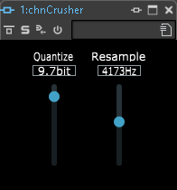

chnCrusher
=========

This is a simple Bit Crusher plugin written using [JUCE](https://juce.com/) as an exercise to demonstrate the effects of time quantization (aliasing) and value quantization (digital noise). The plugin has two parameters:

  - Quantize, ranging from 1.0bit to 16.0bit
  - Resample, ranging from 100Hz to 48000Hz

It doesn't get any simpler than that! :-)
  
To clone and compile chnCrusher, do the following:

    git clone ssh://github.com/chn-dev/chnCrusher
    cd chnCrusher
    git submodule update --init --recursive
    cmake . -B build
    cmake --build build

By default, the plugin will be built in the formats LV2, VST3, AU and as a standalone application. chnCrusher uses JUCE as a submodule, so the third command above will clone [JUCE v7.0.5](https://github.com/juce-framework/JUCE/tree/69795dc8e589a9eb5df251b6dd994859bf7b3fab) under the subdirectory "JUCE".

The guts of the plugin's work is done in PluginProcessor::processBlock().

### Resampling

    double newSampleRate = m_pResample->get();
    double sampleRatio = newSampleRate / m_sampleRate;

sampleRatio is the ratio of the desired resampling frequency to the current output sampling frequency of the plugin host (such as Cubase). 

If the host's output sampling frequency is 44100Hz and we want to resample the signal to 22050Hz, the sample ratio is 22050z / 44100Hz = 0.5. This means that instead of copying every single sample value one-to-one to the output buffer, we have to update the output buffer value only once every 1 / sampleRatio = 2 samples, thereby skipping every second sample.

If the input (x[n]) and output (y[n]) buffers look like this:

    x[n] = [ 1, 2, 3, 4, -4, -3, -2, -1, 0 ]
             |     |      |       |      |
    y[n] = [ 1, 1, 3, 3, -4, -4, -2, -2, 0 ]

That's simple enough for cases where the sample ratio's inverse is a whole number - or in other words, where the output sampling frequency is a whole multiple of the resampling frequency - in our example: 44100Hz = **2** * 22050Hz.

In contrast, a resampling frequency of 17640Hz results in a sample ratio of 17640Hz / 44100Hz = 0.4 - or its inverse 1 / sampleRatio = 2.5.

Because we're in discrete time, we can't update the output buffer's value precisely every 2.5 samples, so we have to update it at varying discrete steps. In this example, we update it at sample numbers #0, #3, #5, #8, #10, #13, and so on. We make steps of 3, 2, 3, 2, 3, .. samples between updates of the output value so that the average step size is 2.5 samples.

x[n] is the input buffer and y[n] the output buffer:

    x[n] = [ 1,   2,   3,   4,  -4,  -3,  -2,  -1,   0,   1,   2,   3   ]
             |              |         |              |         |
    y[n] = [ 1,   1,   1,   4,   4,  -3,  -3,  -3,   0,   0,   2,   2   ]
             |              |         |              |         |
    m_Ofs:   0.0, 0.4, 0.8, 1.2, 1.6, 2.0, 2.4, 2.8, 3.2, 3.6, 4.0, 4.4 ]
    
chnCrusher keeps an internal copy of the current output value in _m_Vals_ (for every channel, so it's a std::vector). It also keeps an internal floating point counter m_Ofs which is increased by 1 / sampleRatio for every input sample. Every time the integer part of m_Ofs increases, the output value is updated with the current input value.

### Value Quantization

In JUCE, all time-discrete signals are represented by a sequence of floating point numbers ranging from -1.0 to +1.0. chnCrusher's "Quantize" parameter (let's call it 'q') is a floating point number representing the number of bits ranging from 1.0 to 16.0. So, the resulting discrete value range is +/- 2^(q-1). For example, if q=4.0, then the resulting discrete value range is +/- 2^3.0 = +/- 8.

Since the input data ranges from -1.0 to +1.0, all chnCrusher does is to multiply the input values with the maximum value (in our example: 8), convert (and round) the result to an integer, convert it back to a floating point and divide it by the maximum value again:

    int32_t mv = pow( 2.0, m_pQuantize->get() - 1.0 ) + 0.5;

    (...)

    int32_t v = ( m_Vals[channel] * mv ) + 0.5;
    pChannelData[j] = (double)v / mv;

Copyright (c) 2023 by chn

http://www.chn-dev.net/

https://mastodon.art/@chn/

chnowak@web.de
